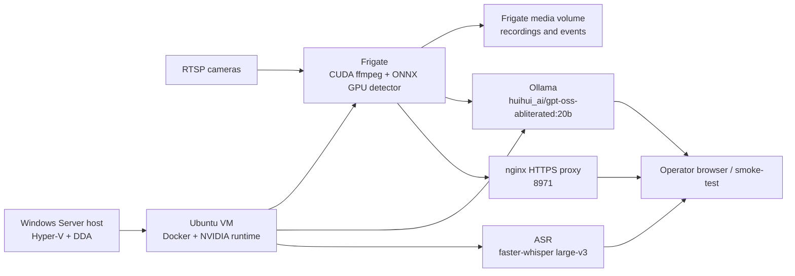

# Architecture

This repository deploys the home video AI stack as code.

## Components

- Windows Server host: Hyper-V, VM autostart, Tesla P40 DDA passthrough.
- Ubuntu VM: Docker, NVIDIA runtime, Frigate, Ollama, nginx HTTPS proxy.
- Frigate: `ghcr.io/blakeblackshear/frigate:stable-tensorrt`.
- Detector: ONNX GPU detector with YOLOv9-t 320 model.
- Ollama model: `huihui_ai/gpt-oss-abliterated:20b`.
- Frigate GenAI descriptions are disabled because the installed gpt-oss model is
  text-only, not a vision model.
- ASR: separate FastAPI/faster-whisper container with an OpenAI-compatible
  transcription endpoint.
- TLS: local self-signed certificate for Frigate `8971` and ASR `9443`.
- Administration: Windows host over WinRM HTTPS `5986` with `PowerShell.7`;
  Ubuntu VM over SSH.

## Runtime Diagram

## Technology Choice

PowerShell over WinRM HTTPS owns the Windows/Hyper-V layer because Hyper-V DDA,
MMIO and VM autostart are native Windows concerns. Raw SSH is not a normal
Windows host administration path. Ansible owns the Ubuntu VM layer because it
gives idempotent package, template, service and Docker Compose management over
SSH without adding an agent.

Terraform/OpenTofu was intentionally not chosen as the primary tool here:
the important mutable state is inside the VM and in Hyper-V DDA settings, not
cloud resources. Docker Compose alone is also not enough because Ollama, nginx,
certificates, model generation and GPU runtime checks are host-level concerns.

## Runtime Paths

- Frigate root: `/opt/frigate`
- Frigate config: `/opt/frigate/config/config.yml`
- Frigate media: `/media/frigate`
- Frigate TLS: `/opt/frigate/certs/fullchain.pem`, `/opt/frigate/certs/privkey.pem`
- YOLO model: `/opt/frigate/config/model_cache/yolov9-t-320.onnx`
- YOLO labelmap: `/opt/frigate/config/model_cache/coco-yolo-80.txt`
- Ollama API: `http://0.0.0.0:11434`
- ASR root: `/opt/asr`
- ASR model cache: `/opt/asr/models`
- ASR API: `https://0.0.0.0:9443`
- LAN Frigate URL: `https://192.168.1.138:8971`
- LAN Ollama URL: `http://192.168.1.138:11434`
- LAN ASR URL: `https://192.168.1.138:9443`
